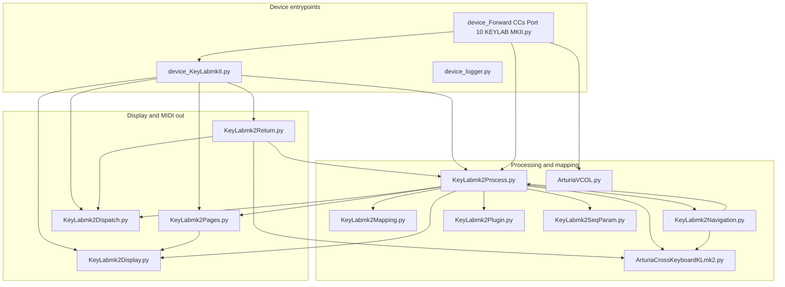

# Arturia KeyLab mkII (P Version) — Script architecture

This folder contains the FL Studio **user MIDI script** for KeyLab mkII and a companion forwarder script. All paths are relative to this directory.

---

## Module dependencies

### Import graph (application modules only)

FL built-ins (`device`, `ui`, `channels`, …) are omitted from the diagram for clarity.

### Layer summary

| Layer | Files | Role |
|--------|--------|------|
| Entrypoints | `device_KeyLabmkII.py`, `device_Forward CCs Port 10 KEYLAB MKII.py`, `device_logger.py` | FL callbacks (`OnInit`, `OnMidiMsg`, …); logger is standalone diagnostics |
| MIDI routing | `KeyLabmk2Dispatch.py` | `MidiEventDispatcher`, `send_to_device` (Arturia SysEx prefix) |
| State + handlers | `KeyLabmk2Process.py` | `KeyLabMidiProcessor`: maps MIDI to FL actions |
| Hardware constants | `KeyLabmk2Mapping.py` | `Hardware` nested classes (pads, DAW buttons, transport, mixer CCs) |
| Screen hints | `KeyLabmk2Navigation.py` | `NavigationMode`: short-lived paged display titles |
| Plugin focus | `KeyLabmk2Plugin.py`, `KeyLabmk2SeqParam.py` | Focused-plugin CC and step-parameter editing |
| Cross-keyboard state | `ArturiaCrossKeyboardKLmk2.py` | Bank offsets `MX_OFFSET` / `CH_OFFSET` shared with mixer/channel views |
| V Collection list | `ArturiaVCOL.py` | `V_COL` plugin name allowlist for forwarding |
| Feedback | `KeyLabmk2Return.py` | LEDs, pad/step feedback, transport LEDs |
| LCD | `KeyLabmk2Display.py`, `KeyLabmk2Pages.py` | Two-line display + timed pages |

### Notable coupling

- `device_Forward CCs Port 10 KEYLAB MKII.py` imports `device_KeyLabmkII as KL`, calls `KL.init()` and **`KL._processor.ProcessEvent(event)`** inside `OnMidiIn`, so the **same** `KeyLabMidiProcessor` instance conceptually serves two device scripts when both are loaded.
- `KeyLabmk2Return.py` imports `KeyLabmk2Process as KLmk2Pr` to read **module-level globals** (`SEQ_MODE`, `MIXER_MODE`, `RECT_OFFSET`, pad mode, `Hardware`, …).

---

## Active features

Derived from `KeyLabMidiProcessor` dispatch tables in `KeyLabmk2Process.py` and satellite modules.

| Area | Behavior |
|------|-----------|
| **Transport** | Play, stop, record, loop; rewind / fast-forward (with bar navigation branches); metronome, overdub, tap tempo, snap mode jog; cut / undo (combined button logic) |
| **Mixer** | 8 faders + master via pitch bend (status 224–232), soft pickup per fader index; relative pan on CC 16–23; track buttons (solo/mute/select/arm semantics); bank prev/next (notes 46/47); master knob/button handling |
| **Channel rack** | When mixer not focused, faders/knobs map to channel volume/pan; bank offsets for channels |
| **Pads** | Drum vs chromatic modes, velocity toggle, color SysEx, FPC note map vs chromatic map; step grid interaction when `SEQ_MODE` active |
| **Step sequencer** | `OnDrumSeqEvent` / `PressSequencer`, `KeyLabmk2SeqParam.Param` for step params; grid bit hold/release |
| **Navigation / UI** | Jog wheel turn/push, window switcher, browser vs mixer vs channel rack focus; pattern prev/next; `ui` rectangle highlights for banks |
| **Display** | `MidiControllerConfig.Sync()` shows selected channel + current pattern on main page; welcome/goodbye pages |
| **Plugin control** | `KeyLabmk2Plugin.Plugin` when plugin window focused; preset next/prev on CC 28/29 via `_plugin_dispatcher` |
| **Analog Lab / port 10** | Companion script forwards CC to port 10 for V Collection–named plugins (`device.forwardMIDICC`) |
| **LED feedback** | `OnRefresh` / `OnIdle` / `OnUpdateBeatIndicator` drive `KeyLabLightReturn` (transport, metronome, loop, pads, group 3–4 DAW LEDs) |

Canonical MIDI layout for controls is documented in [`hardware_map.md`](hardware_map.md).

---

## Dead code and structural issues

Static review: symbols **not** referenced outside their defining file (except class internals), or **superseded** Python definitions.

| Location | Symbol / block | Evidence |
|----------|----------------|----------|
| `ArturiaVCOL.py` | Class `ArturiaVCOLLECTION` and methods `v_col_aff`, `AddVST` | Only `V_COL` list is imported in `device_Forward CCs Port 10 KEYLAB MKII.py`; class never instantiated |
| `ArturiaCrossKeyboardKLmk2.py` | `SetVolumeTrack`, `SetPanTrack` | No remaining callers: earlier `KeyLabMidiProcessor.SetVolumeTrack` / `SetPanTrack` implementations that called these were **overridden** by later methods in the same class (see below) |
| `KeyLabmk2Process.py` | First `SetVolumeTrack` and `SetPanTrack` methods (~lines 924–991) | Python keeps only the **last** definition per name; dispatchers still reference `self.SetPanTrack` / `self.SetVolumeTrack`, which bind to the **later** implementations starting ~1097 / ~1149 |
| `KeyLabmk2Return.py` | `CountdownReturn` | Defined; never called from `device_KeyLabmkII.py` or `KeyLabmk2Process.py` |
| `KeyLabmk2Return.py` | `SetChannelMap` | Defined; no external references |

### Bug / unreachable tail (not “unused” but broken)

In `KeyLabmk2Process.py`, method **`SetPanTrack`** (active definition ~1097): after the relative-delta block (which uses `new_val`), execution continues into a second block that references **`value`**, which is **never assigned** in that method. That will raise `NameError` if reached — likely a copy-paste remnant. Lines ~1138–1147 should be removed or completed with a proper `value` source.

---

## Conflicts and risks

1. **Two device scripts, one processor**  
   `device_Forward CCs Port 10 KEYLAB MKII.py` reuses `KL._processor` from `device_KeyLabmkII.py`. If both scripts are active and the same physical MIDI stream hits both, you can get **double handling** or inconsistent `event.handled` flags. `# receiveFrom` on the forward script must match the **sender name** from the main script’s `device.dispatch` usage (if used); port separation in FL MIDI settings is critical.

2. **Pitch bend: forward vs main**  
   Forward script `OnPitchBend` calls `channels.setChannelPitch` when the focused plugin is **not** in `V_COL`. Main script maps pitch bend status **224–232** to fader volume. Ensure **different MIDI input devices/ports** so one fader is not interpreted both as mixer volume and channel pitch.

3. **Shared module-level globals** (`KeyLabmk2Process.py`)  
   `STATE_MATRIX`, `LED_MATRIX`, `SEQ_MODE`, `MIXER_MODE`, `CURRENT_PAD_MODE`, `RECT_OFFSET`, `INDEX_PRESSED`, etc. are global. Any code that imports this module shares **one** state — fine for a single controller, fragile if duplicated or tested with multiple instances.

4. **`hardware_map.md` vs `KeyLabmk2Mapping.py`**  
   Example: hardware map “DAW Commands” row lists **Read 74 / Write 75**; `Hardware.DAW.Track` uses **56 / 57** for `CONTROL_4_1` / `CONTROL_5_1`. Either firmware mapping drift or intentional remapping — treat as **validation risk** when changing DAW row behavior.

5. **Duplicate method definitions**  
   Aside from confusion, the dead first `SetPanTrack` / `SetVolumeTrack` pair obscured that `ArturiaCrossKeyboardKLmk2` helpers are now unused; future edits may reintroduce divergent behavior.

---

## File list (Python)

| File | Role |
|------|------|
| `device_KeyLabmkII.py` | Primary FL MIDI script |
| `device_Forward CCs Port 10 KEYLAB MKII.py` | CC forward to port 10 + delegates to main processor |
| `device_logger.py` | Optional logging script |
| `KeyLabmk2Process.py` | Core MIDI → FL logic |
| `KeyLabmk2Return.py` | Hardware LED / pad feedback |
| `KeyLabmk2Display.py` | LCD SysEx builder |
| `KeyLabmk2Pages.py` | Timed page manager wrapping display |
| `KeyLabmk2Dispatch.py` | Event dispatcher + `send_to_device` |
| `KeyLabmk2Navigation.py` | Hint lines for user actions |
| `KeyLabmk2Mapping.py` | Numeric hardware map |
| `KeyLabmk2Plugin.py` | Focused-plugin parameter mapping |
| `KeyLabmk2SeqParam.py` | Step parameter editing |
| `ArturiaCrossKeyboardKLmk2.py` | Bank offsets + (currently unreferenced) volume/pan helpers |
| `ArturiaVCOL.py` | V Collection plugin names + unused class |

---

## Code Architecture Documentation

For **current modular architecture** (Phase 8+), see the `codemaps/` directory:
- `codemaps/CODEMAP_INDEX.md` — Navigation and quick start for KI assistance
- `codemaps/handler_chain.md` — Event routing in `OnMidiMsg()`
- `codemaps/state.md` — `KeyLabState` attributes and semantics
- `codemaps/hardware_constants.md` — MIDI mappings from `keylab_config.py`
- `codemaps/adding_handlers.md` — Template for new handler modules
- `codemaps/free_mode.md` — Passthrough logic
- `codemaps/plugin_control.md` — Plugin mode and database schema

*For FL API symbols used in code, cross-check [`FL_Studio_API_Reference.md`](FL_Studio_API_Reference.md). For wire protocol, cross-check [`hardware_map.md`](hardware_map.md).*
